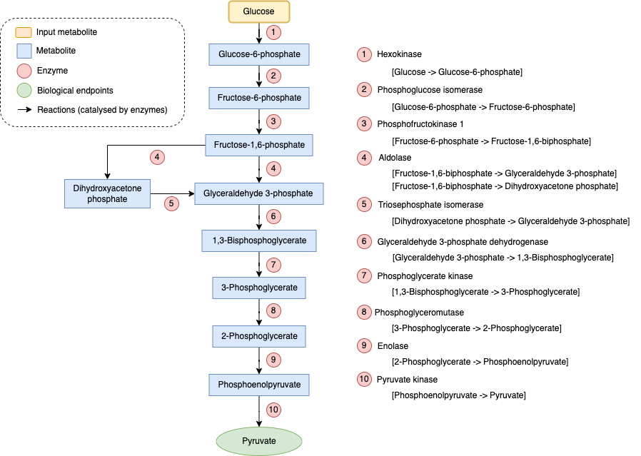
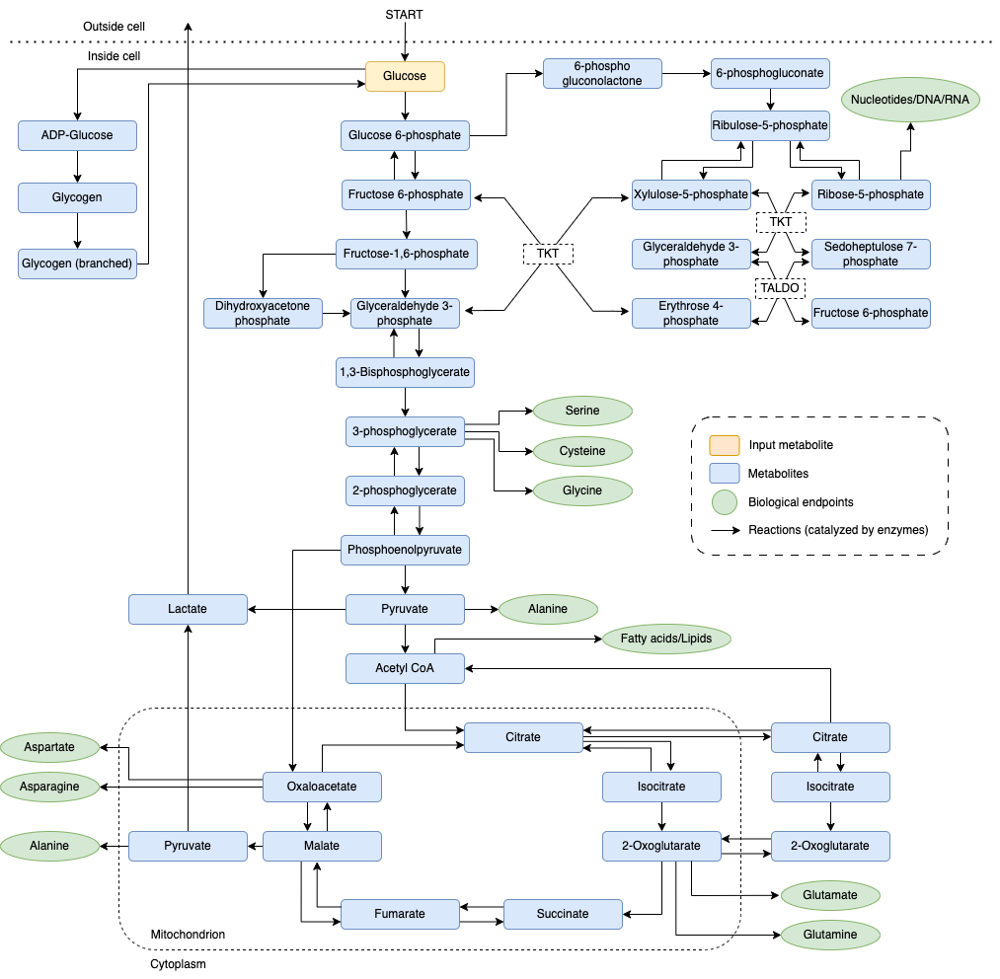

# Assignment 2: Systems Biology

## Objectives
* Implement an algorithm that makes use of the topological structure of a metabolic network in order to answer biological questions.

## Introduction

A metabolic network is a model of interconnected biochemical reactions  in a living organism, like a cell (typically represented as a directed graph). It shows how molecules (metabolites) are transformed through enzymatic reactions (a chemical reaction which is catalyzed by a specific type of protein). These networks help us understand how organisms process nutrients, produce energy, and make essential molecules. They are key in understanding, for example, mechanisms of disease, and potential side-effects of drugs.

Due to the complexity of metabolic networks, they are usually divided inte functional parts (pathways) centered around specific important biological endpoints. For example, in Figure 1, there is a simplified representation of glycolysis. Glycolysis is a central and highly conserved metabolic pathway found in almost all living organisms, from bacteria to humans. It serves as the initial step in the breakdown of glucose, a sugar molecule, to produce energy and various metabolic intermediates. The main biological endpoint of Glycolysis is pyruvate, which is a highly important molecule, serving as a precursor to a large number of essential downstream processes.

> Figure 1: Simplified, non-reversible, schematic of glycolysis

These pathways do not work entirely in isolation. They are usually part of larger modules, wherein several pathways connect to each other through a series of key metabolites. In Figure 2, there is a simplified representation of central carbon metabolism. This refers to a network of interconnected biochemical pathways (Glycolysis, Citric acid cycle, Pentose phosphate pathway, etc.) within a cell that involves the utilisation and interconversion of important carbon-containing compounds. These pathways are entirely central to the organism's metabolism.

> Figure 2: Simplified schematic of central carbon metabolism.

## Exercises

Implement the algorithm of choice yourself. Avoid using existing libraries in which the algorithms are already fully implemented. Basic packages are allowed. The implementation can be done in any program language. The evaluation will be based on both the method and the results.

1. Using the simplified representation of glycolysis in Figure 1, write code that identifies all of the NON-ESSENTIAL enzymes in glycolysis (given that the goal of glycolysis is to produce pyruvate from glucose). A non-essential enzyme in this case denotes an enzyme that can be completely removed from the network (in turn shutting down the reactions it catalyses) without it losing the ability to reach its endpoint. Note that this code should be able to generalise to other types of pathways with a single biological endpoint (e.g. glucose -> pyruvate).

2. The network in Figure 2 is given here as an edge-list ([central_carbon_metabolism](./ccm.csv), along with information on which enzymes are connected to which reaction). Modify your code from task 1 to identify all of the networks ESSENTIAL enzymes (enzymes that can NOT be removed from the network in order for the network to be able to produce ALL of its biological endpoints).

3. You have been tasked to identify enzymes that could be potential targets for a chemotherapy-type drug. To aid you in this, your team has provided you with RNA-counts of a patients healthy cells, but also RNA-counts of their cancer-cells ([RNAcounts](./RNAcounts.csv)). Given this data (and the metabolic network given in Task 2), can you identify enzymes that are suitable to target in order to kill the cancer-cells, but not the patients healthy cells?

    *  You can assume that the drug perfectly inhibits the enzyme, stopping all activity.
        
    * Complete absence of transcripts (RNA molecules) indicates that the enzyme is not expressed at all.
