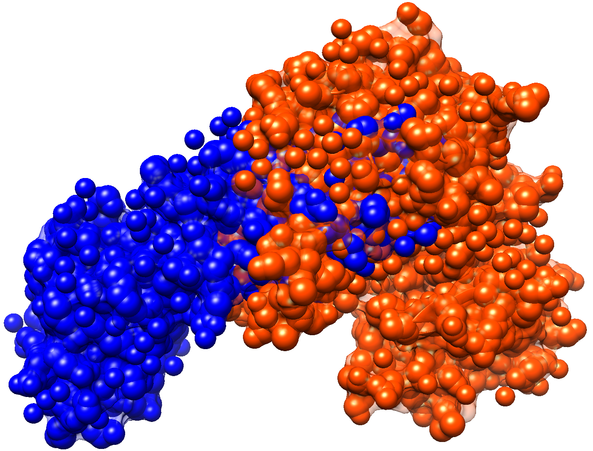

# Assignment 4: Detecting steric overlap

## Objectives
* implement a program that detects steric overlap between two sets of spheres

## Introduction
When modelling protein, or when docking a pair of proteins together, we might want to test whether our solution is free from steric clashes. That is, when considering atoms to be hard spheres, we want to know whether any atoms are so close together that the spheres representing the atoms intersect in 3-D. Typically we will have one rigid set of atoms and a moving set (e.g. in protein modelling, most of a structure can be rigid while a single side chain is rotated interactively; e.g. in protein docking, one molecule might be fixed while another moved around to achieve a good docking pose).

An artificial situation where two structures clash badly with each other can be constructed by using the structures in PDB entries 1CDH and 2CSN. If we simply load these two files into a molecular graphics program, we find that the two structures overlap extensively: hundreds of atoms from one file clash with atoms from the other file. This is shown in the figure below (1CDH is in blue; 2CSN is in red).

## Exercises
Write a program that reads two PDB files (preferably whose names are specified on the command line, although you can hard-code the file names into your program if you find it inconvenient to specify the names on the command line), and prints the atom number of each atom in the second file that overlaps with at least one atom in the first file. You should assume that all atoms have a radius of 2.0 Å (this is simpler than looking up the specific radius of each atom within each residue in a table).

You should count and print out the total number of atom-atom comparisons that are made by your program.

Better solutions are those that require fewer atom-atom comparisons. You are welcome to process the coordinates of the first set of atoms (but not the second set of atoms) in any way that you want, and store these in any data structure(s) that you choose, in order to reduce the number of atom-atom comparisons that are required.

A plain text description of the approach taken, and the data structure(s) chosen to hold the first set of atoms, should be included as a comment in your program.