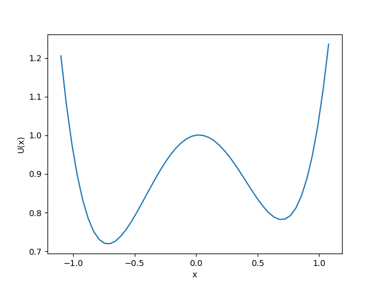
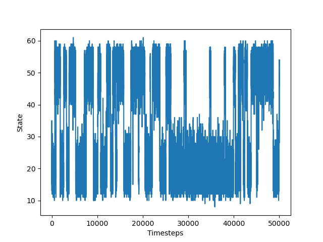
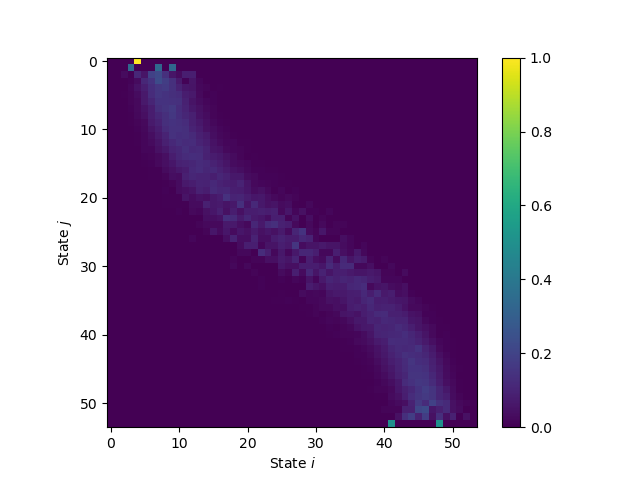
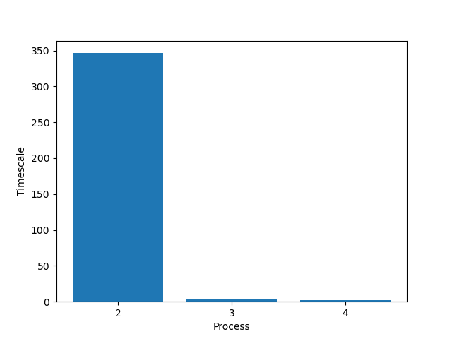
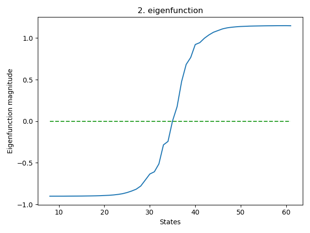

# Assignment 5: Building and Analyzing Markov State Models 

## Objectives
* build a Markov chain from a low-dimensional time series data
    
* analyse the Markov chain and make quantitative statements about its dynamics

## Introduction
Molecular Dynamics (MD) simulations can be used to simulate the behaviour of molecules under specified conditions. While the integration steps are being taken on the femtosecond timescale, relevant biological processes take place several orders of magnitude slower (us, ms, s). In addition, the energy landscape of biomolecules is often complicated and frustrated with many relevant long-lived states. With sufficiently long trajectories, we are, however, able to extract relevant information about the kinetics (timescales of exchange between the states) and thermodynamics (populations of the states). Markov state models (MSMs) represent a useful class of tools to analyse time series data to extract the afore-mentioned parameters.

Here, you see the energy landscape of a two-state toy system:

This is something that we usually do not have access to. Otherwise, sampling from it would be straightforward and easy. Our work often starts with a [trajectory](./traj.txt). It was generated for this system according to its potential energy function (PEF) and represents the energy U of the system in state x. The continuous trajectory was discretized originally into n = 55 states through the process of binning. Here, you see a plot of the discrete trajectory as a function of time:

From its histogram, we can see that we indeed see two states, just as we would expect from the PEF:

We can see macrostate 1 spanning the states from 9-35 and macrostate 2 from 36-61. As we can guess from the energy function, it looks like the slowest transition is between those two macrostates (the middle). That is because the transition barrier is highest.

From the discrete trajectory, we can calculate the count matrix. It is a
states matrix and contains transition counts from state i to state j. Using the count matrix, we can calculate a transition matrix. That is, a matrix that contains the transition probabilities in its entries. It is also a   matrix. In practice, we set a lag time that determines how many steps we can 'skip' (that is the data D will be {1τ, 2τ, 3τ, ...}, where τ is the lag time). In our example, we set the lag time to 1.

Once we have the transition matrix, we can use its spectral properties to get information about the underlying dynamics of the system. The eigenvectors encode the dynamical processes (i.e., between which states the probability moves) and the eigenvalues give us information about the timescale on which those processes are occurring. The higher the eigenvalues the slower processes. Finally, from the stationary distribution, we obtain the relative populations of the respective states. The first eigenvalue and eigenvector is always 1. That is because it belongs to the stationary distribution. In the following plots, the first eigenvalue/eigenvector has always been omitted.

Here, you see a plot of the timescale of the second, third, and fourth process (directly calculated from the eigenvalues):

We can clearly see that the slowest process (the second eigenvalue), is approximately 350 time steps, followed by the third process with ~3 time steps, and finally the fourth process with ~2 time steps. Using the eigenvectors, we see that the slowest process (the second eigenfunction) indeed belongs to the transition between macrostates 1 and 2 as the magnitude of the corresponding eigenfunction changes sign there. The third and fourth eigenfunctions are very fast in comparison with the first and it happens to be some intra-macrostate dynamics that are usually not very interesting. Reproducing these plots with your own program may result in a sign change of the eigenfunction. That is nothing to worry about, as it merely indicates the transfer of probability from one part of the state space to another.

Hence, we can conclude that we indeed have one very slow process that occurs between the two energy minima visible in the energy potential plot. We can say at what timescale this exchange occurs (350 time steps) and which states are involved in the exchange (via the eigenfunctions). Also, we are able to estimate the populations of the two states.

## Exercises

You ran a simulation of a biological system. Now you want to analyse the data to learn more about the system's dynamics:

1. Write a program that reads the [trajectory](./traj-2.txt) file. The columns represent the dimensions. As you will see, you will be working with a two-dimensional system.
2. Discretize the trajectory into 100 clusters to create a one-dimensional discrete trajectory. You may use common libraries (such as SciPy/Numpy). 
3. Plot the trajectory itself as well as a 2D histogram.
4. Write a program that calculates the count matrix from the discretized trajectory. That is, an $n \times n$ matrix that, in its ijth element, contains the number of transitions from i to j and where n is the number of states.
5. Based on the count matrix, calculate the transition matrix. That is, an $n \times n$ matrix that, in its ijth element, contains the transition probability from i to j. Note that the rows sum to one! You may use the trivial estimator described in the lecture slides to calculate the transition matrix.
6. Make comments about what you can say so far about the underlying dynamical system that this trajectory stems from (e.g., how many macrostates do you observe? Can you guess which transition is the slowest?)
7. Calculate the eigenvalues from the obtained transition matrix from $T(\tau)$. What can you say about the timescale of the slowest processes? Assume a lag time $\tau = 1$. You may use common software packages like numpy to do the eigendecomposition. It is possible that you get complex values for the eigenvalues/eigenvector. In that case you may discard the imaginary part. Note that you can easily convert the eigenvalues into timescales (Obs: the formula in the lecture notes misses a minus sign. The correct formula should be $t_{ex,i}(\tau) = - \frac{\tau}{log | \lambda_{i} |}$ )
8. **For those aiming for a higher grade:** Visualise the first few eigenfunctions of the system depending on how many slow processes you observed (keyword: spectral gap). Describe what the eigenfunctions tell you about the system in question. Your visualization may look something like this: `plt.scatter(*traj.T, c=eigvecs[:, i][dtraj])` where traj is the continuous trajectory, eigvecs are the n by n eigenvector matrix , where you're accessing the ith eigenvector, and dtraj is the discretized trajectory.
9. **For those aiming for a higher grade:** Discretize the continuous trajectory again (trajectory file). This time in 
    1. 3
    2. 10
    3. 100
    4. 1000
    
    states and visualize the leading eigenfunctions and timescales as a function of number of states (3, 10, 100, 1000). Comment on the quality of the discretization as the number of states increase. Also, do you see a difference in the estimated timescale of the slowest process as the number of states increases? Comment on why or why not you observe these differences.

You may test the performance of your algorithms with the trajectory provided in the introduction.